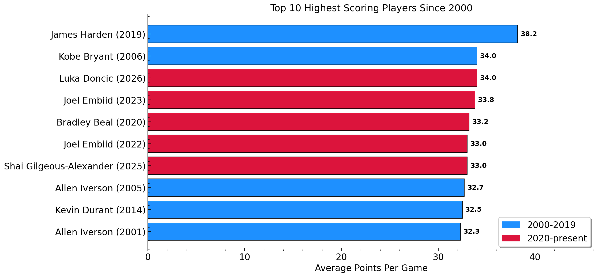
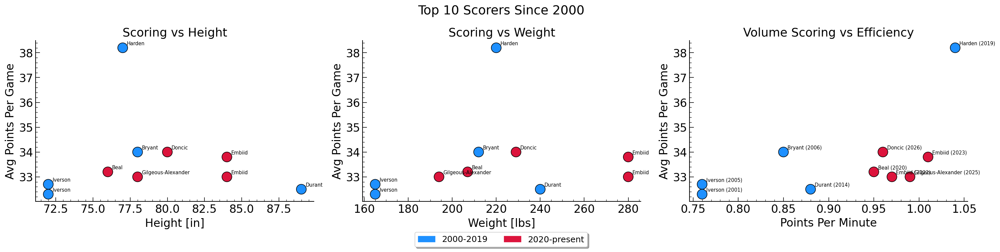
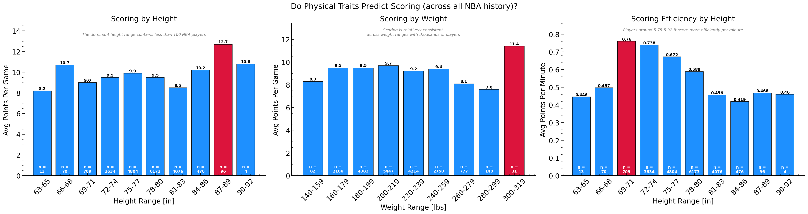
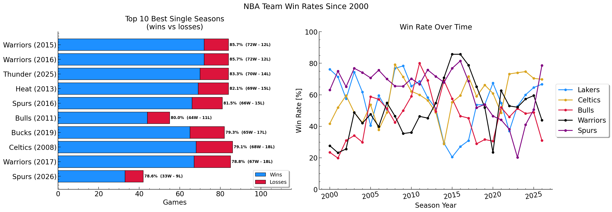
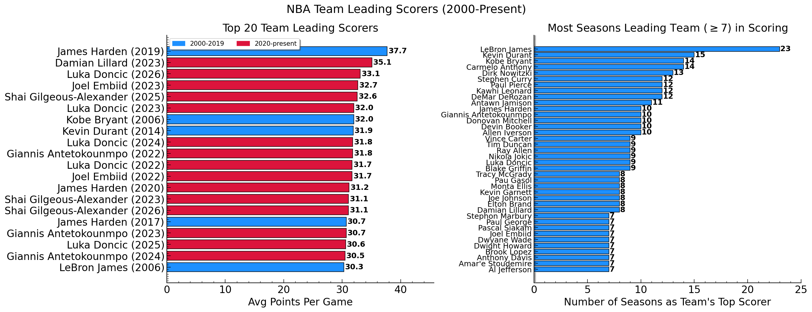
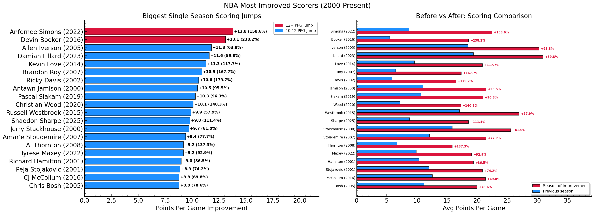
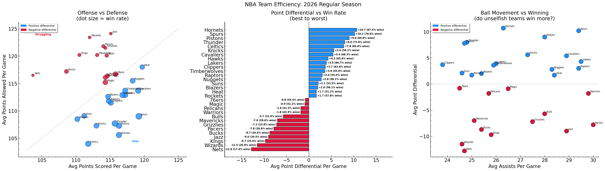
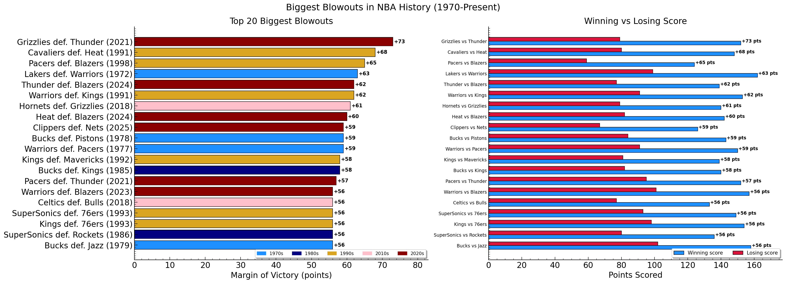

# NBA Historical Analytics

SQL and Python analysis of NBA game data spanning 1947 to the present. Built as a persional project to develop and practice applied SQL skills using a real world dataset.

**Dataset:** [Historical NBA Data and Player Box Scores](https://www.kaggle.com/datasets/eoinamoore/historical-nba-data-and-player-box-scores) — Kaggle

**Stack:** SQLite, Python, pandas, matplotlib

**Database:** 9 tables, ~22,000+ player-seasons across 70+ years of game logs

---

## Analysis

### 1. Top scoring players since 2000: physical and efficiency traits ('top_scorers.py')

**Q:** Who are the 10 highest scoring players in the NBA from 2000 onwards, and what physical and efficiency traits do they share?

The query pulls height, weight, position, and draft round alongside box score averages since 2000. Points per minute is computed.

In terms of data quality issues, I noticed that columns such as position and draft round were missing values. So, they were ignored in the final analysis.

**A:** James Harden in the 2019 season help the moost average points per grame with 38.2 while Allen Iverson in the 2001 season had the least average number of points per game at 32.3. An interesting fact is that James Harden is always an outlier in terms of average number of points per game and physics traits. Harden also has the best points per minute to average number of points per game.

---

### 2. Do physical traits predict scoring across NBA history? (`all_top_scorers.py`)

**Q:** Across 22,000+ players in all seasons of the NBA history, do taller or heavier players score more?

This query began from a thought I had to extend the top scorers analysis to the full dataset rather than just the top 10. Players are binned by height (3 in intervals) and weight (20 lb interverals) and average points per game (PPG) is computed per bin.

**A:** Height and weight are surprisingly weak predictors of scoring output. The 87-89 inch bin shows the highest average (12.7 PPG) but contains only 96 players. The core 75-80 inch range, with thousands of players shows no meaningful trend.

Weight also shows no correlation at all. The distribution is essentially flat from 140 to 260 lbs. Scoring efficiency (points per minute) by height tells the opposite story: players between 69 to 74 in are the most efficient per minute.

The number of players falling into each bin are printed directly on the bar for transparency.

---

### 3. Team win rates since 2000 (`team_win_rates.py`)

**Q:** Which teams have been most dominant since 2000, and how has it played out over time?

**A:** I computed the win rate as `SUM(win) * 100.0 / COUNT(gameId)`. Wins and losses are shown as stacked bars so the W-L record is visible alongside win rate. The W-L distribution makes it easy to see which teams are better. The Warriors hold the best W-L percentages in the 20115 and 2016 season.

The line chart tracks five franchises across 25 seasons. The Spurs line is the most analytically interesting. It is remarkably stable from 2000 through 2016, then a sharp decline. This might be when all their great players retired, and the team struggled to recruit equivalent replacements. The Warriors show the opposite: near-irrelevance until 2013, then one of the steepest rises in NBA history. They also fell to a low point in 2020 before rebounding back upwards.

---

### 4. Team leading scorers: who were they and how consistently were they? (`player_rankings.py`)

**Q:** Who is the primary scorer on each team each season, and which players have held that role most consistently?

In this question, I computed two queries. In the first one, I attempted to construct a CTE to compute seasonal averages and rank every player within thier team for each season. In the second query, I used the same CTE structure but looked at a different final SELECT to count how many times each player has held the top scorer spot since 2000 to investigate consistency.

**A:** James Harden comes in first for the top 20 team leadering scorers with 37.7 average points per game back in the 2019 season. Luka Doncic, who recently got traded, also has 33.1 average points per game in the 2026 season. On the other hand, it becomes apparent in the analysis on the right that Lebron James has led his team in the most seasons (23) for being the highest scorer followed by Kevin Durant (15)

---

### 5. Most improved scorers year over year (`most_improved.py`)

**Q:** Who made the biggest single season scoring jump since 2000, and was the improvement sustained?

I use `LAG(avg_points) OVER (PARTITION BY player_name ORDER BY season_year)` to pull each player's previous season average into their current row for updated stats. I also use 'LEAD()' to check for improvement throughout the following season. I used a minimum previous season threshold of 5 PPG to filter out injury returns where a player went from almost zero minutes to a full season.

**A:** I find that the biggest single season scoring were done by Anfernee Simons in 2022 and Devin Booker in 2016, as these two players both had more than 12 PPG jumps. While Booker's 2016 jump of +13.1 PPG looks smaller than Anfernee Simons' 2022 umpy of +13.8 PPG, Booker actually showed a +238.2% improvement.

---

### 6. Offensive vs defensive team efficiency in the 2026 season (`team_efficiency.py`)

**Q:** Which teams are genuinely dominant, and does point differential predict wins better than raw scoring? Also, do teams that share the ball win more?

The point differential measurement is the core metric. This might be more predictive of future performance than win rate because it captures the actual amrgin of dominance rather than treating a 1 point win to a 20 point win. I used the SQL 'RANK()' to create a ranking column.

**A:** The Hornets lead the league in point differentials this season at +10.7 with a 67.4% win rate, followed closely by the Spurs (+10.2, 78.6% wins). I find a strong relationship between point differentials and winning, where teams with larger points differences have larger win rates. They are in the elite category. Interestingly, I also find that the Nets are a clear outlier. They are low scorers with low points allowed. They also have a -12.8 differential with only 17.4% wins. This points that in the 2026 season, the Nets neither scored nor defended effectively. I also find no obvious correlation between ball movement and winning in this dataset. Teams ranging from 24 to 29 assists per game are distributed across both positive and negative differentials. This suggests to me that at the team level, sharing the ball alone cannot predict losing or winning.

---

### 7. Biggest blowouts in NBA history (1970-present) (`blowouts.py`)

**Q:** What are the most lopsided regular season games since 1970, and when are they most common?

I computed the margin of victory regardless of home or away outcome and used 'CASE WHEN' statements for the first time. The data is filtered to 1970+ to remove early era games where pace and scoring norms were fundamentally different, making cross-era comparisons more meaningful. The data is also sorted into decades.

**A:** The 2021 Memphis Grizzlies defeat of the Oklahoma City Thunder by 73 points is the largest margin in the dataset. The Thunder only scored aroun d80 points. Large blowouts have happened every decade.

---

## SQL concepts used

| Concept | Scripts |
| --- | --- |
| `SELECT`, `WHERE`, `GROUP BY`, `HAVING`, `ORDER BY` | all |
| `JOIN` across multiple tables | top_scorers, team_win_rates, team_efficiency, blowouts |
| Aggregation: `AVG`, `SUM`, `COUNT`, `ROUND` | all |
| `SUBSTR`, `\|\|` string concatenation | all |
| CTE (`WITH`) | player_rankings, most_improved, team_efficiency |
| `RANK()`, `PARTITION BY` | player_rankings, team_efficiency |
| `LAG()`, `LEAD()` | most_improved |
| `CASE WHEN` conditional logic | team_efficiency, blowouts |
| `ABS()` | blowouts |
| Calculated columns | team_win_rates, team_efficiency, blowouts |
